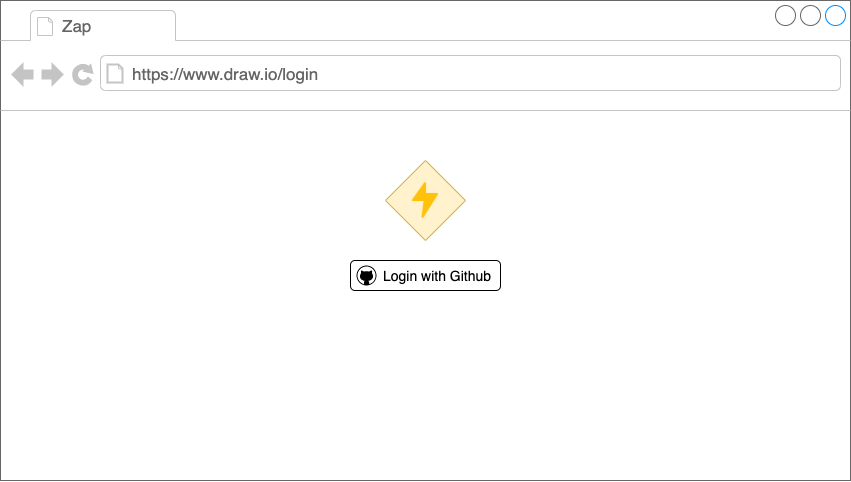
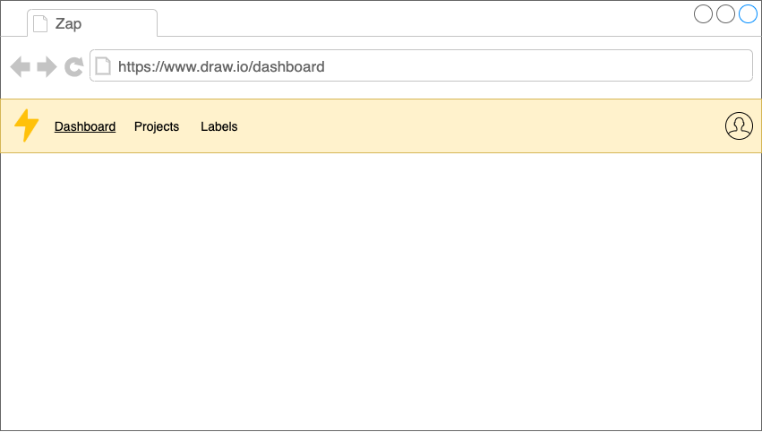
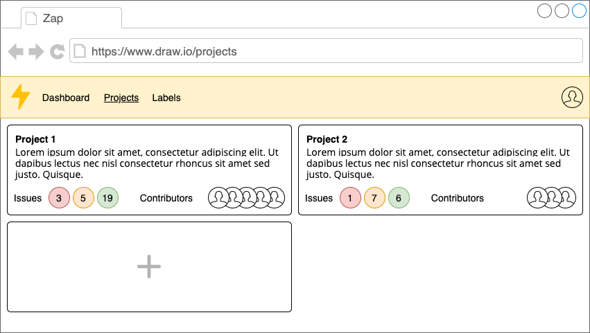
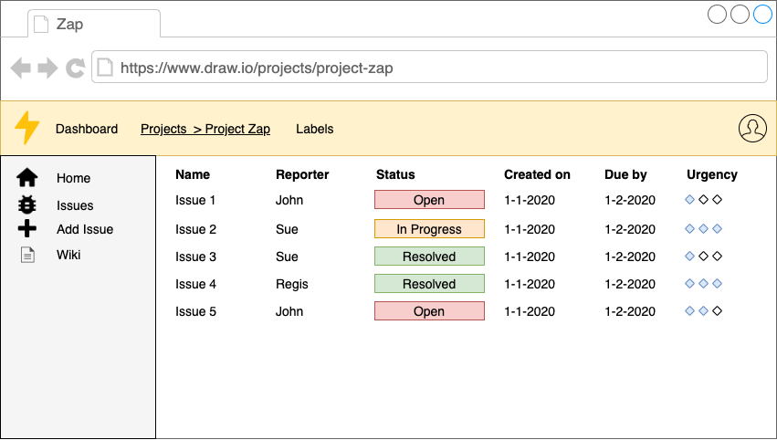

# Zap

Zap is a bug tracker that allows developers to do easily track bugs and issues in their (web)application.

## Stack

-  React
-  React Router
-  Redux
-  Redux Thunk
-  Axios
-  Node.js

## Intended Features

-  Login with Github OAuth API
-  Views:
   -  Dashboard
   -  Projects (choose project)
      -  Home
      -  Issues
      -  Add issue
   -  User
-  Track multiple projects at once
-  Add labels to issues

## Mockups

Login screen v1

Dashboard screen v1

Projects screen v1

Project screen v1

